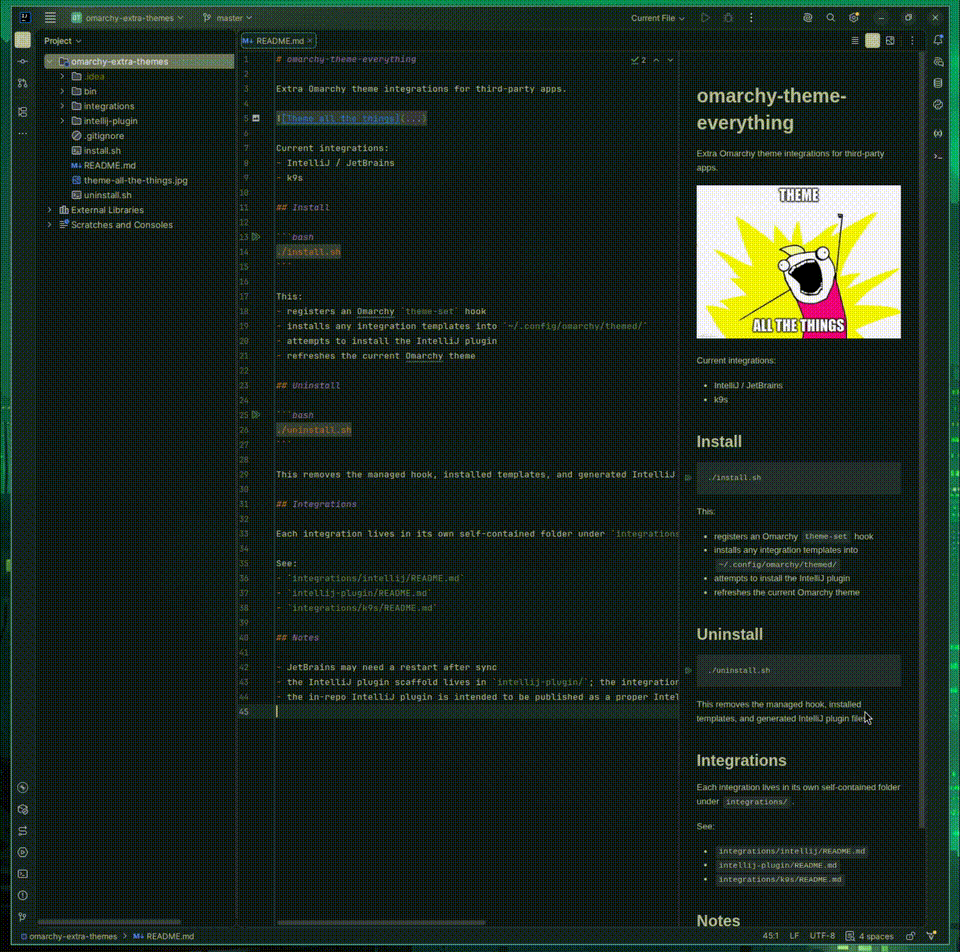

# IntelliJ integration

This is the in-repo IntelliJ / JetBrains integration.

## Overview

This integration:
- generates runtime theme data on every Omarchy hook run
- notifies the installed plugin to refresh when present

## Activation

The integration is active when:
- `~/.config/JetBrains` exists

The plugin must be installed for IntelliJ theme sync and hot-reload to work inside the IDE. Theme data generation itself does not depend on plugin installation.

## Future

The in-repo plugin scaffold is intended to become a published IntelliJ plugin in the future.
