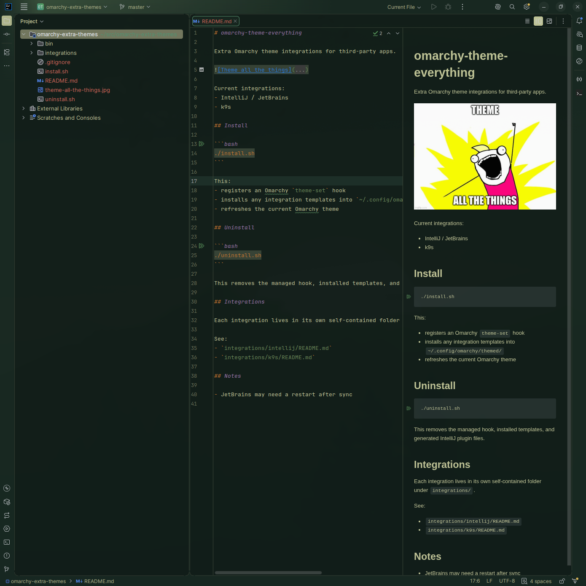
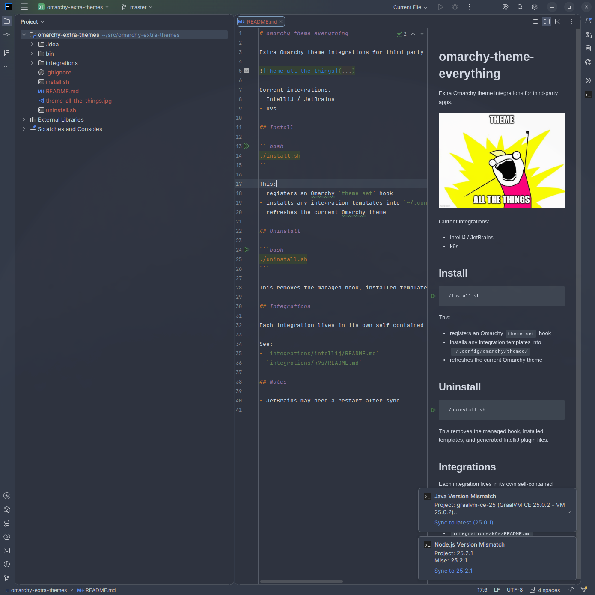

# IntelliJ integration

This is the in-repo IntelliJ / JetBrains integration.

## Overview

This integration:
- generates runtime theme data on every Omarchy hook run
- notifies the installed plugin to refresh when present

## Files

- `integration.toml` — activates this integration when JetBrains config is present
- `apply.sh` — Omarchy hook entrypoint
- `generate-theme.py` — writes normalized runtime theme data
- `../../intellij-plugin/` — IntelliJ plugin source scaffold
- `../../intellij-plugin/bin/install-plugin` — attempts to build/install the plugin

## Runtime output

Generated files live under:
- `~/.config/omarchy-theme-everything/intellij/`

Current files:
- `theme.json`
- `refresh.token`

## Activation

The integration is active when:
- `~/.config/JetBrains` exists

The plugin itself is optional for now; theme data generation does not depend on plugin installation.

## Future

The in-repo plugin scaffold is intended to become a published IntelliJ plugin in the future.
