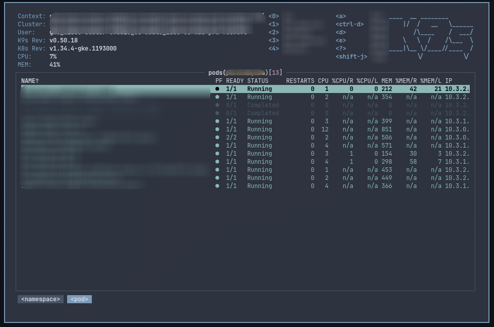
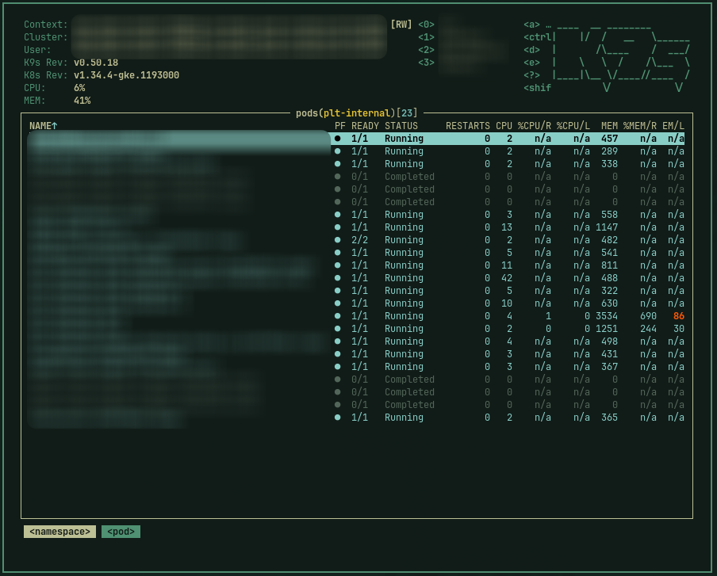

# k9s integration




This integration generates and installs an Omarchy skin for k9s.

Installed skin:
- `~/.config/k9s/skins/omarchy.yaml`

k9s must be configured to use it in `~/.config/k9s/config.yaml`:

```yaml
k9s:
  ui:
    skin: omarchy
```

Manual run:

```bash
./integrations/k9s/apply.sh
```
